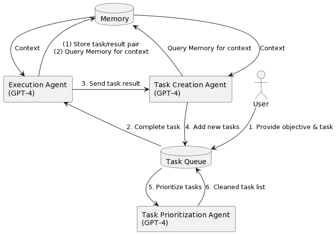

# Auto-GPT：一个自主的 GPT-4 实验


[](https://discord.gg/PQ7VX6TY4t)

### 简介
给 Auto-GPT 一个目标，它将调用chatgpt的智慧，调用各种工具action，不断逼近直到实现这个目标。     

比如，你可以给它100元基础资金，设定目标让他自己帮你赚钱。      
比如，你可以设定，让他做各种事请，让世界更美好。    
比如，你可以设定，让他创建自己组织，并尽可能的扩大自己的组织 等等等等         

Auto-GPT 是一个实验性的开源应用程序，展示了 GPT-4 语言模型的能力。这个程序由 GPT-4 驱动，将 LLM “思想”链接在一起，自主地实现您设定的任何目标。作为 GPT-4 完全自主运行的第一个示例之一，Auto-GPT 推动了人工智能可能性的边界。  

### 赚钱思路分享
1. 国内传统无货源销售，机器人自动生成文案，找客户，自动成交
2. 自由写作，机器人生成作品，自动发布，自动写作
3. 自动营销

如果对你有帮助，请点击右上角，帮我star.   
[欢迎加入国内AI商业应用交流群](#国内交流群)
新的中文汉化版本+汉化安装文档请移步[AutoGPT-ZH](https://github.com/RiseInRose/AutoGPT-ZH)

群主实际体验以后（使用gpt3.5），发现autogpt能做的事情非常有限（还很傻）！！！（但是这个想法非常有潜力）！！！   
还是一句话，大家不要焦虑，不要焦虑。后续群主会录制测评视频。来科普实际情况。
gpt4的版本，如果大家有gpt4接口，可以私信群主，群主帮助大家做测评

### 原理图
很多人问我，autogpt 运行原理是什么样的，特地补充一张图.  


### 注意
这个超级费apikey，看到自己的钱包😄    
其次可以考虑，调用国内免费的一些接口。有开发能力的同学，写一个适配器就好了。

### 紧急通知：   
请使用 `stable` 而不是 `master`。我们已经改进了我们的工作流程，`master` 分支通常会处于 **不可用状态**。请在此处下载最新的 `stable` 发布版：https://github.com/Torantulino/Auto-GPT/releases/latest 。   
这个信息比任何后续的信息都要重要。请先执行这个指令而不是那个。     


### 演示（2023年3月30日）：

https://user-images.githubusercontent.com/22963551/228855501-2f5777cf-755b-4407-a643-c7299e5b6419.mp4

## 目录

- [Auto-GPT: 自主 GPT-4 实验](#auto-gpt-自主-gpt-4-实验)
    - [🔴 🔴 🔴 紧急：使用 `stable` 而不是 `master` 🔴 🔴 🔴](#----urgent-use-stable-not-master----)
    - [演示（2023年3月30日）：](#demo-30032023)
  - [目录](#目录)
  - [🚀 特性](#-特性)
  - [📋 需求](#-需求)
  - [💾 安装](#-安装)
  - [🔧 使用](#-使用)
    - [日志](#日志)
    - [Docker](#docker)
    - [命令行参数](#命令行参数)
  - [🗣️ 语音模式](#️-语音模式)
  - [🔍 Google API 密钥配置](#-google-api-密钥配置)
    - [设置环境变量](#设置环境变量)
  - [内存后端设置](#内存后端设置)
    - [Redis 设置](#redis-设置)
    - [🌲 Pinecone API 密钥设置](#-pinecone-api-密钥设置)
    - [Milvus 设置](#milvus-设置)
    - [设置环境变量](#设置环境变量-1)
  - [设置缓存类型](#设置缓存类型)
  - [查看内存使用情况](#查看内存使用情况)
  - [🧠 内存预填充](#-内存预填充)
  - [💀 连续模式 ⚠️](#-连续模式-️)
  - [仅限 GPT3.5 模式](#仅限-gpt35-模式)
  - [🖼 图像生成](#-图像生成)
  - [⚠️ 限制](#️-限制)
  - [🛡 免责声明](#-免责声明)


## 🚀 特点

- 🌐 搜索和信息收集的互联网访问
- 💾 长期和短期记忆管理
- 🧠 GPT-4实例用于文本生成
- 🔗 访问流行的网站和平台
- 🗃️ 使用GPT-3.5进行文件存储和摘要

## 📋 要求

- 环境（选择一个即可）
  - [vscode + devcontainer](https://marketplace.visualstudio.com/items?itemName=ms-vscode-remote.remote-containers)：已在 .devcontainer 文件夹中配置，可以直接使用
  - [Python 3.8或更高版本](https://www.tutorialspoint.com/how-to-install-python-in-windows)
- [OpenAI API key](https://platform.openai.com/account/api-keys)

可选：

- 内存后端
  - [PINECONE API key](https://www.pinecone.io/)（如果你想要 Pinecone 支持存储日志，默认本地就行）
  - [Milvus](https://milvus.io/)（如果您想使用Milvus作为内存后端）
- [ElevenLabs Key](https://elevenlabs.io/) (如果你想让人工智能说话)

## 💾 安装

要安装 Auto-GPT，请按照下列步骤操作：

1. 确保满足上述所有**要求**，如果没有，请安装/获取它们。

以下命令需要在终端执行

2. 克隆存储库：对于此步骤，您需要安装 Git，但您可以通过单击此页面顶部的按钮来下载 zip 文件☝️

```
git clone git@github.com:kaqijiang/Auto-GPT-ZH.git
```

3. 终端中 cd到项目目录

```
cd 'Auto-GPT-ZH'
```

4. 终端中安装所需的依赖项

```
pip install -r requirements.txt
```

5. 将 `.env.template` 重命名为 `.env`，并填写您的 `OPENAI_API_KEY`。如果您计划使用语音模式，请填写您的 `ELEVENLABS_API_KEY`。
  - 参见[OpenAI API密钥配置](#openai-api-keys-configuration)中的说明以获取您的OpenAI API密钥。
  - 从此处获取您的ElevenLabs API密钥：https://elevenlabs.io。您可以在网站上的“个人资料”选项卡中查看xi-api-key。
  - 如果您想在Azure实例上使用GPT，则将 `USE_AZURE` 设置为 `True`，然后按照以下步骤操作：
    - 将 `azure.yaml.template` 重命名为 `azure.yaml` 并提供相关的 `azure_api_base`、`azure_api_version` 以及 `azure_model_map` 部分中所有相关模型的部署ID：
      - `fast_llm_model_deployment_id` - 您的 gpt-3.5-turbo 或 gpt-4 部署ID
      - `smart_llm_model_deployment_id` - 您的 gpt-4 部署ID
      - `embedding_model_deployment_id` - 您的 text-embedding-ada-002 v2 部署ID
    - 请将所有这些值指定为双引号字符串
    > 将尖括号（<>）中的字符串替换为您自己的ID
    ```yaml
    azure_model_map:
      fast_llm_model_deployment_id: "<my-fast-llm-deployment-id>"
      ...
    ```
    - 详细信息可以在这里找到：https://pypi.org/project/openai/，位于 `Microsoft Azure Endpoints` 部分和这里：https://learn.microsoft.com/en-us/azure/cognitive-services/openai/tutorials/embeddings?tabs=command-line 的嵌入模型。

## 终端代理方法

Mac 下载 [ClashX Pro](https://install.appcenter.ms/users/clashx/apps/clashx-pro/distribution_groups/public) 设置 系统代理 增强模式 然后复制终端代理命令 在终端中输入，重启即可

根据自己的工具修改对应的端口

```
export https_proxy=http://127.0.0.1:8484 http_proxy=http://127.0.0.1:8484 all_proxy=socks5://127.0.0.1:8484
```

Windows 下载 [Clash for Windows](https://wws.lanzoux.com/iCEgLj27fra)，设置 系统代理 ，在终端中输入，重启即可。

根据自己的工具修改对应的端口

```
# 使用 http 类型代理
set http_proxy=http://127.0.0.1:8484
set https_proxy=http://127.0.0.1:8484
# 使用 socks 类型代理
netsh winhttp set proxy proxy-server="socks=127.0.0.1:8484" bypass-list="localhost"
netsh winhttp show proxy
netsh winhttp reset proxy
# 使用 socks 类型代理
set http_proxy=socks5://127.0.0.1:8484
set https_proxy=socks5://127.0.0.1:8484
```


## 🔧 使用方法

1. 在终端中运行 `autogpt` Python 模块

```
python -m autogpt
```

2. 在每个动作之后，从选项中选择授权命令、退出程序或向AI提供反馈。
   1. 授权单个命令，请输入 `y`
   2. 授权一系列 _N_ 个连续的命令，请输入 `y -N`
   3. 退出程序，请输入 `n`


### 日志

活动和错误日志位于 `./output/logs` 中

要打印调试日志：

```
python -m autogpt --debug
```
### Docker

您还可以将其构建为Docker映像并运行它：

```
docker build -t autogpt .
docker run -it --env-file=./.env -v $PWD/auto_gpt_workspace:/app/auto_gpt_workspace autogpt
```

您可以传递额外的参数，例如，以 `--gpt3only` 和 `--continuous` 模式运行：
```
docker run -it --env-file=./.env -v $PWD/auto_gpt_workspace:/app/auto_gpt_workspace autogpt --gpt3only --continuous
```
### 命令行参数
以下是使用Auto-GPT时可用的一些常见参数：
> 将所有尖括号（<>）中的内容替换为要指定的值
* 查看所有可用的命令行参数
```bash
python scripts/main.py --help
```
* 使用不同的 AI 设置文件运行 Auto-GPT
```bash
python scripts/main.py --ai-settings <filename>
```
* 指定 3 种内存后端之一：`local`、`redis`、`pinecone` 或 `no_memory`
```bash
python scripts/main.py --use-memory  <memory-backend>
```

> **注意**：有一些标志的简写方式，例如 `-m` 表示 `--use-memory`。使用 `python scripts/main.py --help` 获取更多信息。

## 🗣️ 语音模式

使用此功能在 Auto-GPT 中使用 TTS _(文本到语音)_。

```bash
python -m autogpt --speak
```

### ElevenLabs 的 ID 列表及名称，您可以使用名称或 ID：

- Rachel: 21m00Tcm4TlvDq8ikWAM
- Domi: AZnzlk1XvdvUeBnXmlld
- Bella: EXAVITQu4vr4xnSDxMaL
- Antoni: ErXwobaYiN019PkySvjV
- Elli: MF3mGyEYCl7XYWbV9V6O
- Josh: TxGEqnHWrfWFTfGW9XjX
- Arnold: VR6AewLTigWG4xSOukaG
- Adam: pNInz6obpgDQGcFmaJgB
- Sam: yoZ06aMxZJJ28mfd3POQ


## OpenAI API密钥配置

从此处获取您的OpenAI API密钥：https://platform.openai.com/account/api-keys。

要在Auto-GPT中使用OpenAI API密钥，您需要设置计费（付费帐户）。

您可以在 https://platform.openai.com/account/billing/overview 上设置付费帐户。


## 🔍 Google API密钥配置

此部分是可选的，如果使用Google搜索时出现错误429，请使用官方Google API。

要使用 `google_official_search` 命令，您需要在环境变量中设置您的Google API密钥。

1. 转到 [Google Cloud Console](https://console.cloud.google.com/)。
2. 如果您还没有帐户，请创建一个并登录。
3. 通过单击页面顶部的“选择项目”下拉菜单并单击“新建项目”来创建一个新项目。给它一个名称，然后单击“创建”。
4. 转到 [API 和服务仪表板](https://console.cloud.google.com/apis/dashboard)，然后单击“启用 API 和服务”。搜索“Custom Search API”，然后单击它，然后单击“启用”。
5. 转到[凭据](https://console.cloud.google.com/apis/credentials)页面，然后单击“创建凭据”。选择“API密钥”。
6. 复制API密钥，并将其设置为名为`GOOGLE_API_KEY`的环境变量。请参见下面设置环境变量。
7. [在项目上启用](https://console.developers.google.com/apis/api/customsearch.googleapis.com)自定义搜索API。（可能需要等待几分钟才能传播）
8. 转到[自定义搜索引擎](https://cse.google.com/cse/all)页面，然后单击“添加”。
9. 按照提示设置您的搜索引擎。您可以选择搜索整个Web或特定网站。
10. 创建搜索引擎后，请单击“控制面板”，然后单击“基本知识”。复制“搜索引擎ID”，并将其设置为名为`CUSTOM_SEARCH_ENGINE_ID`的环境变量。请参见下面设置环境变量。

_请记住，您每天免费的自定义搜索配额仅允许最多100次搜索。要增加此限制，您需要将计费帐户分配给项目，以获得高达10K次每日搜索的收益。_

### 设置环境变量

对于Windows用户：

```bash
setx GOOGLE_API_KEY "YOUR_GOOGLE_API_KEY"
setx CUSTOM_SEARCH_ENGINE_ID "YOUR_CUSTOM_SEARCH_ENGINE_ID"
```

对于macOS和Linux用户：

```bash
export GOOGLE_API_KEY="YOUR_GOOGLE_API_KEY"
export CUSTOM_SEARCH_ENGINE_ID="YOUR_CUSTOM_SEARCH_ENGINE_ID"
```

## Redis 设置
> _**注意**_ \
此处不适用于公共访问，没有安全措施。因此，避免未设置密码或完全向互联网暴露Redis。

1. 安装docker桌面版
```bash
docker run -d --name redis-stack-server -p 6379:6379 redis/redis-stack-server:latest
```
> 请参见 https://hub.docker.com/r/redis/redis-stack-server 以设置密码和其他配置。

2. 设置以下环境变量
> 将尖括号（<>）中的**PASSWORD**替换为您的密码
```bash
MEMORY_BACKEND=redis
REDIS_HOST=localhost
REDIS_PORT=6379
REDIS_PASSWORD=<PASSWORD>
```
您还可以选择设置

```bash
WIPE_REDIS_ON_START=False
```

以在Redis中保留存储的内存

您可以使用以下命令指定Redis的内存索引：

```bash
MEMORY_INDEX=<WHATEVER>
```

### 🌲 Pinecone API密钥设置

Pinecone 可以存储大量基于向量的内存，从而使代理每次仅加载有关内存。

1. 转到 [pinecone](https://app.pinecone.io/)，如果您还没有帐户，请创建一个。
2. 选择 `Starter` 计划以避免被收费。
3. 在左侧边栏的默认项目下找到您的API密钥和区域。

### Milvus 设置

[Milvus](https://milvus.io/) 是一个开源的、高可扩展的向量数据库，用于存储大量基于向量的内存并提供快速相关搜索。

- 设置 Milvus 数据库，保持 pymilvus 版本和 milvus 版本相同，以避免兼容性问题。
  - 使用开源软件安装 [Install Milvus](https://milvus.io/docs/install_standalone-operator.md)
  - 或使用 [Zilliz Cloud](https://zilliz.com/cloud) 进行安装
- 在 `.env` 中设置 `MILVUS_ADDR` 为您的 milvus 地址 `host:ip`。
- 在 `.env` 中将 `MEMORY_BACKEND` 设置为 `milvus`，以启用 milvus 作为后端。
- 可选项
  - 在 `.env` 中设置 `MILVUS_COLLECTION`，以按需更改 milvus 集合名称，默认名称为 `autogpt`。

### 设置环境变量

在 `.env` 文件中设置：
- `PINECONE_API_KEY`
- `PINECONE_ENV`（例如：“us-east4-gcp”）
- `MEMORY_BACKEND=pinecone`

或者，您可以从命令行设置它们（高级）：

对于Windows用户：

```bash
setx PINECONE_API_KEY "<YOUR_PINECONE_API_KEY>"
setx PINECONE_ENV "<YOUR_PINECONE_REGION>" # 例如: "us-east4-gcp"
setx MEMORY_BACKEND "pinecone"
```

对于macOS和Linux用户：

```bash
export PINECONE_API_KEY="<YOUR_PINECONE_API_KEY>"
export PINECONE_ENV="<YOUR_PINECONE_REGION>" # 例如: "us-east4-gcp"
export MEMORY_BACKEND="pinecone"
```

## 设置缓存类型

默认情况下，Auto-GPT 将使用 LocalCache 而不是 redis 或 Pinecone。

要切换到其中任何一个，请将 `MEMORY_BACKEND` 环境变量更改为您想要的值：

`local` (默认) 使用本地 JSON 缓存文件
`pinecone` 使用您在 ENV 设置中配置的 Pinecone.io 帐户
`redis` 将使用您配置的 redis 缓存

## 查看内存使用情况

1. 使用 `--debug` 标志查看内存使用情况 :)

## 🧠 内存预填充

# python autogpt/data_ingestion.py -h 
用法: data_ingestion.py [-h] (--file FILE | --dir DIR) [--init] [--overlap OVERLAP] [--max_length MAX_LENGTH]

将一个或多个文件的目录摄入到内存中。在运行此脚本之前，请确保设置了您的 .env。

选项:
  -h, --help               显示帮助信息并退出
  --file FILE              要摄取的文件。
  --dir DIR                包含要摄取的文件的目录。
  --init                   初始化内存并擦除其内容（默认值：False）
  --overlap OVERLAP        摄取文件时块之间的重叠大小（默认值：200）
  --max_length MAX_LENGTH  摄取文件时每个块的最大长度（默认值：4000）

这个位于 autogpt/data_ingestion.py 的脚本允许您在运行 Auto-GPT 之前将文件摄入内存并进行预填充。

内存预填充是一种技术，它涉及将相关文档或数据摄入 AI 的内存中，以便它可以使用这些信息来生成更具见解和准确的响应。

为了预填充内存，将每个文档的内容分成指定最大长度、具有指定块之间重叠的块，然后将每个块添加到在 .env 文件中设置的内存后端中。当 AI 被提示回忆信息时，它可以访问那些预填充的记忆来生成更具见解和准确的响应。

当处理大量数据或需要 AI 快速访问特定信息时，这种技术尤其有用。
通过预填充内存，AI 可以更有效地检索和使用这些信息，节省时间、API 调用并提高其响应的准确性。

例如，在运行 Auto-GPT 之前，您可以下载 API 文档、GitHub 存储库等，并将其摄入内存。

⚠️ 如果您将 Redis 用作内存，请确保在您的 `.env` 文件中将 `WIPE_REDIS_ON_START` 设置为 `False` 来运行 Auto-GPT。

⚠️ 对于其他内存后端，我们当前强制清除内存，在启动 Auto-GPT 时也是如此。要摄取具有这些内存后端的数据，可以在 Auto-GPT 运行期间随时调用 `data_ingestion.py` 脚本。

内存将立即可供 AI 使用，即使在 Auto-GPT 运行时摄入。

在上面的示例中，脚本初始化了内存，将 `/seed_data` 目录中的所有文件与块之间的重叠设置为 200，并将每个块的最大长度设置为 4000 摄入了内存中。
请注意，您也可以使用 `--file` 参数将单个文件摄入内存中，而脚本仅会摄取 `/auto_gpt_workspace` 目录中的文件。

您可以调整 `max_length` 和重叠参数来微调 AI "recall" 该内存时向其呈现文档的方式：

- 调整重叠值允许 AI 在回忆信息时访问更多的上下文信息，但将导致创建更多的块，从而增加内存后端使用和 OpenAI API 请求。
- 减少 `max_length` 值会创建更多的块，这可以通过在上下文中允许更多的消息历史记录来节省提示符令牌，但也会增加块的数量。
- 增加 `max_length` 值将为 AI 提供更多的上下文信息，减少创建块的数量并节省 OpenAI API 请求。但是，这可能使用更多的提示符令牌并减少 AI 可用的总上下文。

## 免责声明
本项目 Auto-GPT 是一个实验性应用程序，按“原样”提供，没有任何明示或暗示的保证。通过使用这个软件，您同意承担与其使用相关的所有风险，包括但不限于数据丢失、系统故障或其他可能发生的问题。

本项目的开发者和贡献者不承担任何因使用此软件而导致的损失、损害或其他后果的责任或义务。您对基于 Auto-GPT 提供的信息做出的决策和行动完全负责。

请注意，由于 GPT-4 语言模型的令牌使用，使用它可能会很昂贵。通过利用本项目，您承认自己有责任监测和管理自己的令牌使用量及所带来的费用。强烈建议定期检查您的 OpenAI API 使用情况，并设置必要的限制或警报以防止意外费用。

作为一项自主实验，Auto-GPT 可能会产生不符合现实业务实践或法律要求的内容或行动。您有责任确保基于该软件输出所做出的任何行动或决策符合适用法律、法规和道德标准。本项目的开发者和贡献者不对因使用此软件而引起的任何后果承担责任。

通过使用 Auto-GPT，您同意赔偿、保护并使开发者、贡献者和任何关联方免受因您使用本软件或违反这些条款而引发的任何和所有索赔、损害、损失、责任、费用和支出（包括合理的律师费用）的影响。

## 国内交流群
群主会不定期发布 各类亮眼项目体验版本 供大家体验，星球会不定期发布一些商业化的 AI 工具。欢迎各位读者老爷，漂亮姐姐给我的项目点赞！

|              关注公众号进群               |                      知识星球                       |
|:-------------------------------:|:-----------------------------------------------:|
|  |  |


## 感谢
该项目大部分翻译自 [Auto-GPT](https://github.com/Torantulino/Auto-GPT#%EF%B8%8F-speech-mode) 

<h2 align="center"> 💖 支持 Auto-GPT 的发展 💖</h2><p align="center">
如果您可以支持一杯咖啡的费用，您就可以帮助支付开发Auto-GPT的API成本，并推动完全自主的人工智能的界限！
一整天的开发可能会花费多达20美元的API费用，对于一个免费项目来说，这是非常有限的。
非常感谢您的支持。
</p>

<p align="center">
这个免费的开源项目的开发得益于所有<a href="https://github.com/Torantulino/Auto-GPT/graphs/contributors">贡献者</a>和<a href="https://github.com/sponsors/Torantulino">赞助商</a>。如果您想赞助这个项目，并希望在下面显示您的头像或公司标志，请<a href="https://github.com/sponsors/Torantulino">点击这里</a>。
<h3 align="center">Individual Sponsors</h3>
<p align="center">
<a href="https://github.com/robinicus"></a>&nbsp;&nbsp;<a href="https://github.com/prompthero"></a>&nbsp;&nbsp;<a href="https://github.com/crizzler"></a>&nbsp;&nbsp;<a href="https://github.com/tob-le-rone"></a>&nbsp;&nbsp;<a href="https://github.com/FSTatSBS"></a>&nbsp;&nbsp;<a href="https://github.com/toverly1"></a>&nbsp;&nbsp;<a href="https://github.com/ddtarazona"></a>&nbsp;&nbsp;<a href="https://github.com/Nalhos"></a>&nbsp;&nbsp;<a href="https://github.com/Kazamario"></a>&nbsp;&nbsp;<a href="https://github.com/pingbotan"></a>&nbsp;&nbsp;<a href="https://github.com/indoor47"></a>&nbsp;&nbsp;<a href="https://github.com/AuroraHolding"></a>&nbsp;&nbsp;<a href="https://github.com/kreativai"></a>&nbsp;&nbsp;<a href="https://github.com/hunteraraujo"></a>&nbsp;&nbsp;<a href="https://github.com/Explorergt92"></a>&nbsp;&nbsp;<a href="https://github.com/judegomila"></a>&nbsp;&nbsp;
<a href="https://github.com/thepok"></a>
&nbsp;&nbsp;<a href="https://github.com/SpacingLily"></a>&nbsp;&nbsp;<a href="https://github.com/merwanehamadi"></a>&nbsp;&nbsp;<a href="https://github.com/m"></a>&nbsp;&nbsp;<a href="https://github.com/zkonduit"></a>&nbsp;&nbsp;<a href="https://github.com/maxxflyer"></a>&nbsp;&nbsp;<a href="https://github.com/tekelsey"></a>&nbsp;&nbsp;<a href="https://github.com/digisomni"></a>&nbsp;&nbsp;<a href="https://github.com/nocodeclarity"></a>&nbsp;&nbsp;<a href="https://github.com/tjarmain"></a>
</p>