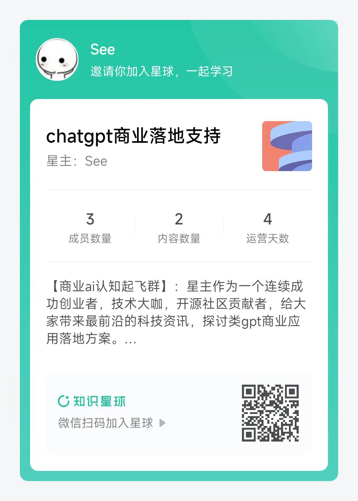

# Auto-GPT：一个自主的 GPT-4 实验


[](https://discord.gg/PQ7VX6TY4t)

--- 
### 简介
给 Auto-GPT 一个目标，它将调用chatgpt的智慧，调用各种工具action，不断逼近直到实现这个目标。     

比如，你可以给它100元基础资金，设定目标让他自己帮你赚钱。      
比如，你可以设定，让他做各种事请，让世界更美好。    
比如，你可以设定，让他创建自己组织，并尽可能的扩大自己的组织 等等等等         

Auto-GPT 是一个实验性的开源应用程序，展示了 GPT-4 语言模型的能力。这个程序由 GPT-4 驱动，将 LLM “思想”链接在一起，自主地实现您设定的任何目标。作为 GPT-4 完全自主运行的第一个示例之一，Auto-GPT 推动了人工智能可能性的边界。  
[国内交流群](#国内交流群)

### 注意
这个超级费apikey，看到自己的钱包😄    
其次可以考虑，调用国内免费的一些接口。有开发能力的同学，写一个适配器就好了。

### 演示（2023年3月30日）：

https://user-images.githubusercontent.com/22963551/228855501-2f5777cf-755b-4407-a643-c7299e5b6419.mp4

<h2 align="center"> 💖 支持 Auto-GPT 的发展 💖</h2><p align="center">
如果您可以支持一杯咖啡的费用，您就可以帮助支付开发Auto-GPT的API成本，并推动完全自主的人工智能的界限！
一整天的开发可能会花费多达20美元的API费用，对于一个免费项目来说，这是非常有限的。
非常感谢您的支持。
</p>

<p align="center">
这个免费的开源项目的开发得益于所有<a href="https://github.com/Torantulino/Auto-GPT/graphs/contributors">贡献者</a>和<a href="https://github.com/sponsors/Torantulino">赞助商</a>。如果您想赞助这个项目，并希望在下面显示您的头像或公司标志，请<a href="https://github.com/sponsors/Torantulino">点击这里</a>。
<h3 align="center">Individual Sponsors</h3>
<p align="center">
<a href="https://github.com/robinicus"></a>&nbsp;&nbsp;<a href="https://github.com/prompthero"></a>&nbsp;&nbsp;<a href="https://github.com/crizzler"></a>&nbsp;&nbsp;<a href="https://github.com/tob-le-rone"></a>&nbsp;&nbsp;<a href="https://github.com/FSTatSBS"></a>&nbsp;&nbsp;<a href="https://github.com/toverly1"></a>&nbsp;&nbsp;<a href="https://github.com/ddtarazona"></a>&nbsp;&nbsp;<a href="https://github.com/Nalhos"></a>&nbsp;&nbsp;<a href="https://github.com/Kazamario"></a>&nbsp;&nbsp;<a href="https://github.com/pingbotan"></a>&nbsp;&nbsp;<a href="https://github.com/indoor47"></a>&nbsp;&nbsp;<a href="https://github.com/AuroraHolding"></a>&nbsp;&nbsp;<a href="https://github.com/kreativai"></a>&nbsp;&nbsp;<a href="https://github.com/hunteraraujo"></a>&nbsp;&nbsp;<a href="https://github.com/Explorergt92"></a>&nbsp;&nbsp;<a href="https://github.com/judegomila"></a>&nbsp;&nbsp;
<a href="https://github.com/thepok"></a>
&nbsp;&nbsp;<a href="https://github.com/SpacingLily"></a>&nbsp;&nbsp;<a href="https://github.com/merwanehamadi"></a>&nbsp;&nbsp;<a href="https://github.com/m"></a>&nbsp;&nbsp;<a href="https://github.com/zkonduit"></a>&nbsp;&nbsp;<a href="https://github.com/maxxflyer"></a>&nbsp;&nbsp;<a href="https://github.com/tekelsey"></a>&nbsp;&nbsp;<a href="https://github.com/digisomni"></a>&nbsp;&nbsp;<a href="https://github.com/nocodeclarity"></a>&nbsp;&nbsp;<a href="https://github.com/tjarmain"></a>
</p>

## 目录

- [Auto-GPT: 一个自主的GPT-4实验](#Auto-GPT: 一个自主的GPT-4实验)
  - [演示（30/03/2023）：](#演示（30/03/2023）)
  - [💖 帮助资助Auto-GPT的开发](#-帮助资助Auto-GPT的开发)
  - [目录](#目录)
  - [🚀 特点](#-特点)
  - [📋 要求](#-要求)
  - [💾 安装](#-安装)
  - [🔧 使用](#-使用)
  - [🗣️ 语音模式](#️-语音模式)
  - [🔍 谷歌API密钥配置](#-谷歌API密钥配置)
    - [设置环境变量](#设置环境变量)
  - [💀 连续模式 ⚠️](#-连续模式-️)
  - [仅限GPT3.5模式](#仅限GPT3.5模式)
  - [🖼 图像生成](#图像生成)
  - [⚠️ 限制](#️-限制)
  - [🛡 免责声明](#-免责声明)
  - [🐦 在Twitter上关注我们](#-在Twitter上关注我们)

## 🚀 特点

- 🌐 可以进行搜索和信息收集的互联网访问
- 💾 长期和短期记忆管理
- 🧠 使用 GPT-4 实例进行文本生成
- 🔗 访问流行网站和平台
- 🗃️ 使用 GPT-3.5 进行文件存储和摘要。

## 📋 要求

- [Python 3.8 or later](https://www.tutorialspoint.com/how-to-install-python-in-windows)
- [OpenAI API key](https://platform.openai.com/account/api-keys)
- [PINECONE API key](https://www.pinecone.io/)

Optional:

- ElevenLabs Key (If you want the AI to speak)

## 💾 安装

要安装Auto-GPT，请按照以下步骤进行操作：

0. 确保您拥有上述所有的要求，如果没有，请安装或获取它们。
下面的命令应该在CMD、Bash或Powershell窗口中执行。为此，请进入计算机上的一个文件夹，单击顶部的文件夹路径并输入CMD，然后按回车键。

1. 克隆存储库： 对于这个步骤，您需要已安装Git，但是您也可以通过点击此页面顶部的按钮下载zip文件来代替。☝️

```
git clone https://github.com/Torantulino/Auto-GPT.git
```

2. 前往项目目录：
   _(请在CMD窗口中输入以下内容，以将CMD窗口导航到刚刚下载的存储库所在位置：)_

```
cd 'Auto-GPT'
```

3. 安装必需的依赖项：
   _(同样，请在CMD窗口中输入以下内容：)_

```
pip install -r requirements.txt
```

4. 请将 .env.template 文件重命名为 .env，并填写您的 OPENAI_API_KEY。如果您计划使用语音模式，请同时填写您的 ELEVEN_LABS_API_KEY。

- 您可以从以下网址获取OpenAI API密钥：https://platform.openai.com/account/api-keys.
- 您可以从以下网址获取ElevenLabs API密钥：https://elevenlabs.io。您可以在该网站的“个人资料”选项卡中查看您的 xi-api-key。
- 如果您想在Azure实例上使用GPT，请将 USE_AZURE 设置为 True，并根据此处的说明提供 OPENAI_AZURE_API_BASE、OPENAI_AZURE_API_VERSION 和 OPENAI_AZURE_DEPLOYMENT_ID 值：https://pypi.org/project/openai 位于“Microsoft Azure Endpoints”部分。此外，您需要为嵌入和聊天分别添加独立的部署。分别将其ID值添加到 OPENAI_AZURE_CHAT_DEPLOYMENT_ID 和 OPENAI_AZURE_EMBEDDINGS_DEPLOYMENT_ID 中。
## 🔧 使用

1. 请在终端中运行 main.py Python脚本:
   _(Type this into your CMD window)_

```
python scripts/main.py
```

2. 在 AUTO-GPT 的每个操作后，输入 “NEXT COMMAND” 以授权它们继续执行。
3. 要退出程序，请输入 “exit” 并按回车键。

### 日志

您可以在文件夹 `./logs` 中找到活动和错误日志。

要输出调试日志：

```
python scripts/main.py --debug
```

## 🗣️ 语音模式

您可以使用以下内容为Auto-GPT添加TTS功能：

```
python scripts/main.py --speak
```

## 🔍 谷歌API密钥配置

此部分是可选的，如果在运行谷歌搜索时遇到错误429问题，请使用官方谷歌API。
要使用 `google_official_search` 命令，您需要在环境变量中设置谷歌 API 密钥。

1. 打开 [Google Cloud 控制台](https://console.cloud.google.com/)。
2. 如果您还没有帐户，请创建一个并登录。
3. 点击页面顶部的“选择项目”下拉列表，然后点击“新建项目”来创建一个新项目。命名该项目，然后点击“创建”。
4. 转到 [API 和服务仪表板](https://console.cloud.google.com/apis/dashboard)，并单击“启用 API 和服务”。搜索“Custom Search API”，然后单击它，接着单击“启用”按钮。
5. 转到 [凭据](https://console.cloud.google.com/apis/credentials) 页面，然后单击“创建凭据”。选择“API 密钥”。
6. 复制 API 密钥，并将其设置为名为 `GOOGLE_API_KEY` 的环境变量。查看以下关于设置环境变量的说明。
7. 转到 [自定义搜索引擎](https://cse.google.com/cse/all) 页面，然后单击“添加”。
8. 按照提示设置您的搜索引擎。您可以选择搜索整个网站或特定站点。
9. 创建完成搜索引擎后，单击“控制面板”，然后点击“基础知识”。复制“搜索引擎 ID”，并将其设置为名为 `CUSTOM_SEARCH_ENGINE_ID` 的环境变量。查看以下关于设置环境变量的说明。


请注意，您每天免费的自定义搜索配额最多只允许100次搜索。要增加此限制，您需要为项目指定一个计费账户，以获得高达10K次每天的搜索。

### 设置环境变量

对于 Windows 用户：

```
setx GOOGLE_API_KEY "YOUR_GOOGLE_API_KEY"
setx CUSTOM_SEARCH_ENGINE_ID "YOUR_CUSTOM_SEARCH_ENGINE_ID"

```

对于 macOS 和 Linux 用户：

```
export GOOGLE_API_KEY="YOUR_GOOGLE_API_KEY"
export CUSTOM_SEARCH_ENGINE_ID="YOUR_CUSTOM_SEARCH_ENGINE_ID"

```

## Redis 配置

安装 Docker Desktop。

运行以下命令：

```
docker run -d --name redis-stack-server -p 6379:6379 redis/redis-stack-server:latest
```

有关设置密码和其他配置，请参见 https://hub.docker.com/r/redis/redis-stack-server。

设置以下环境变量：

```
MEMORY_BACKEND=redis
REDIS_HOST=localhost
REDIS_PORT=6379
REDIS_PASSWORD=
```

请注意，此设置不打算面向互联网运行，也不安全。请勿在没有密码或完全开放的情况下将 Redis 暴露给互联网。

您可以选择设置

```
WIPE_REDIS_ON_START=False
```

以保留存储在 Redis 中的内存数据。

您可以使用以下内容指定 Redis 的内存索引：

```
MEMORY_INDEX=whatever
```

## 🌲 Pinecone API 密钥设置

Pinecone 使得存储大量基于向量的内存成为可能，从而允许仅在任何给定时间加载与代理相关的记忆。

1. 访问 app.pinecone.io，如果还没有账户，请创建一个账户。
2. 选择“Starter”计划以避免被收费。
3. 在左侧边栏的默认项目下找到您的 API 密钥和区域。

### 设置环境变量

只需在 `.env` 文件中设置它们即可。

或者，您也可以通过命令行进行设置 (高级用户)：

对于 Windows 用户：

```
setx PINECONE_API_KEY "YOUR_PINECONE_API_KEY"
setx PINECONE_ENV "Your pinecone region" # something like: us-east4-gcp

```

对于 macOS 和 Linux 用户：

```
export PINECONE_API_KEY="YOUR_PINECONE_API_KEY"
export PINECONE_ENV="Your pinecone region" # something like: us-east4-gcp

```

## 设置缓存类型

默认情况下，Auto-GPT 将使用 LocalCache 而不是 redis 或 Pinecone。

要切换到其中任何一种，请将 `MEMORY_BACKEND` 环境变量更改为您想要的值：

`local` (默认) 使用本地 JSON 缓存文件
`pinecone` 使用您在 ENV 设置中配置的 Pinecone.io 帐户。
`redis` 将使用您配置的 Redis 缓存。

## 查看内存使用情况

1. 通过使用 `--debug` 标志查看内存使用情况 :)

## 💀 连续模式 ⚠️

**无需** 用户授权即可运行 AI，100％自动化。
不建议使用连续模式。
它可能是危险的，并且可能导致您的 AI 永远运行或执行您通常不会授权的操作。
自行承担风险。

1. 在终端中运行 `main.py` Python脚本：

```
python scripts/main.py --continuous

```

2. 要退出程序，请按 Ctrl + C

## 仅 GPT3.5 模式

如果您没有访问 GPT4 API，则可以使用此模式使用 Auto-GPT！

```
python scripts/main.py --gpt3only
```

建议对于需要高安全措施的任务使用虚拟机，以防止对主计算机系统和数据造成任何潜在的伤害。

## 🖼 图像生成

默认情况下，Auto-GPT 使用 DALL-e 进行图像生成。要使用 Stable Diffusion，需要 [HuggingFace API Token](https://huggingface.co/settings/tokens)。

一旦您获得了令牌，请在 `.env` 中设置以下变量：

```
IMAGE_PROVIDER=sd
HUGGINGFACE_API_TOKEN="YOUR_HUGGINGFACE_API_TOKEN"
```

## ⚠️ 限制

该实验旨在展示 GPT-4 的潜力，但存在一些限制：

1. 不是一个完整的应用程序或产品，只是一个实验。
2. 在复杂的现实业务场景中可能表现不佳。如果它的确表现出色，请分享您的结果！
3. 运行成本相当昂贵，因此请设置并监控 OpenAI 的 API 密钥限制！

## 🛡 免责声明

这个项目 Auto-GPT 是一个实验性应用程序，按 "原样" 提供，并且没有任何形式的保证，明示或暗示。通过使用这个软件，您同意承担与其使用相关的所有风险，包括但不限于数据丢失、系统故障或任何其他可能出现的问题。

该项目的开发人员和贡献者不承担任何损失、损害或其他后果的责任。您对基于 Auto-GPT 提供的信息所做出的任何决策和行动完全负责。

请注意，由于其令牌使用量，使用 GPT-4 语言模型可能非常贵。通过使用此项目，您确认自己有责任监控和管理自己的令牌使用量及相关费用。强烈建议定期检查 OpenAI API 的使用情况，并设置任何必要的限制或警报以防止意外收费。

作为自主实验，Auto-GPT 可能会生成与现实业务实践或法律要求不符的内容或采取行动。您有责任确保基于该软件产生的输出所做出的任何行动或决策符合所有适用的法律、法规和道德标准。该项目的开发人员和贡献者不承担因使用该软件而导致的任何后果的责任。

如果使用 Auto-GPT，您需要同意赔偿、捍卫和使开发人员、贡献者和任何附属方免受任何和所有索赔、损害、损失、责任、成本和费用（包括合理律师费）的影响，这些影响是由您使用本软件或违反这些条款导致的。


## 国内交流群
群主会不定期发布 各类亮眼项目体验版本 供大家体验，星球会不定期发布一些商业化的 AI 工具。欢迎各位读者老爷，漂亮姐姐给我的项目点赞！

|              直接加群               |                 如果前面的过期，加我拉你入群                  |                      知识星球                       |
|:-------------------------------:|:-----------------------------------------------:|:-----------------------------------------------:|
|  |  |  |


## 感谢
该项目大部分翻译自 [Auto-GPT](https://github.com/Torantulino/Auto-GPT#%EF%B8%8F-speech-mode) 
